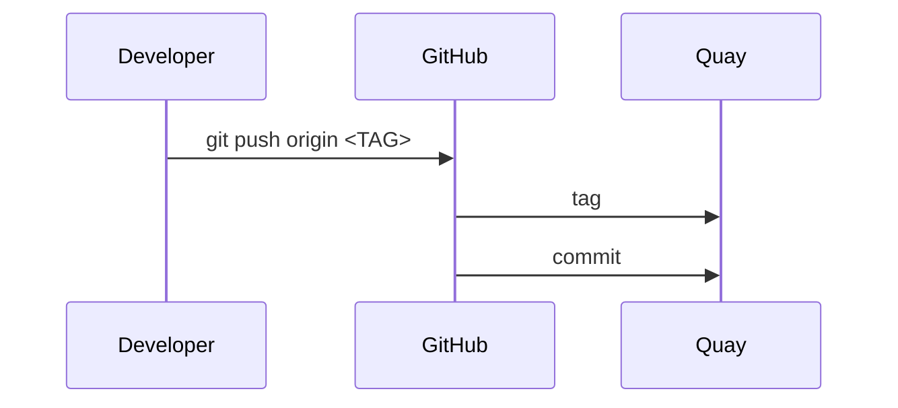

# Contributing 🤝

This project is developed by the [Ellrott Lab](https://ellrottlab.org/) at the [Knight Cancer Institute](https://www.ohsu.edu/knight-cancer-institute) in [PDX, Oregon](https://www.travelportland.com/).

# Releases 🚀

## Docker Images (Quay.io) 🐳

For every release that's triggered, the following resources will be created:

| Resource                     | Example                                              |
|------------------------------|------------------------------------------------------|
| [Tag][tags]                  | [v0.11.6][tag-example]                               |
| [Docker image][quay]         | [quay.io/ohsu-comp-bio/funnel:v0.11.6][quay-example] |
| [GitHub Release][releases]   | [v0.11.6][release-example]                           |
| [Homebrew Package][homebrew] | [Funnel@v0.11.6][homebrew-example]                   |

[tags]: https://github.com/ohsu-comp-bio/funnel/tags
[tag-example]: https://github.com/ohsu-comp-bio/funnel/commit/046db6f1ecc4eb2445f0cbe8511f516f74060b9b

[quay]: https://quay.io/repository/ohsu-comp-bio/funnel
[quay-example]: https://quay.io/repository/ohsu-comp-bio/funnel?tab=tags&tag=v0.11.6

[releases]: https://github.com/ohsu-comp-bio/funnel/releases
[release-example]: https://github.com/ohsu-comp-bio/funnel/releases/tag/v0.11.6

[homebrew]: https://github.com/ohsu-comp-bio/homebrew-formula/tree/master
[homebrew-example]: https://github.com/ohsu-comp-bio/homebrew-formula/blob/master/Formula/funnel.rb

[gopkg]: https://pkg.go.dev/github.com/ohsu-comp-bio/funnel
[gopkg-example]: https://pkg.go.dev/github.com/ohsu-comp-bio/funnel@v0.11.6

  

## Commits

Funnel releases follow [semantic versioning](https://semver.org/) and are automatically built using the [Semantic Version](https://github.com/semantic-release/semantic-release) package and it's [GitHub Action](https://github.com/PaulHatch/semantic-version) via [`release.yaml`](./.github/workflows/release.yaml).

| Commit Type  | Example Commit                                                           | Release                             |
|--------------|--------------------------------------------------------------------------|-------------------------------------|
| **fix**      | `fix: example message`                                                   | Patch Release: `v0.1.0` → `v0.1.1` |
| **feat**     | `feat: example message`                                                  | Minor Release: `v0.1.0` → `v0.2.0` |
| **breaking** | `example: example message`  `BREAKING CHANGE: example description` | Major Release: `v0.1.0` → `v1.0.0` |

> [!TIP]
> For a full list of commit types see Angualar's [Commit Message Format](https://github.com/angular/angular/blob/main/contributing-docs/commit-message-guidelines.md#type) and the [Convention Commits spec](https://www.conventionalcommits.org/en/v1.0.0/)

# Suggesting Changes

You can propose changes to Funnel by opening [**issues**](https://github.com/ohsu-comp-bio/funnel/issues) or [**pull requests**](https://github.com/ohsu-comp-bio/funnel/pulls) for discussion and review. For substantial changes, we recommend starting with an issue to discuss scope and feasibility.

When submitting pull requests, please use your own fork—even if you have write access to the repository. This helps keep the main repository clean and organized.

# Security

If you discover a security vulnerability, please email <mailto:security-notification@ga4gh.org> with details.

# Contributors

> Made with [contrib.rocks](https://contrib.rocks).

