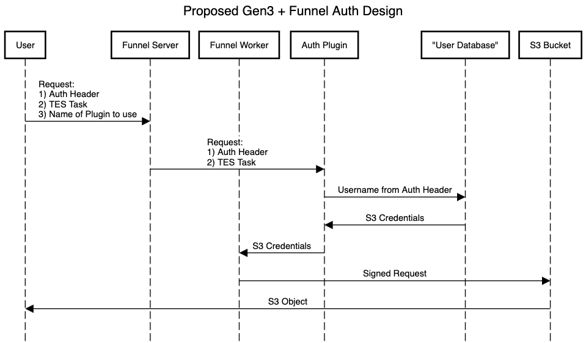

[](https://github.com/ohsu-comp-bio/funnel-plugins/actions/workflows/go.yaml)
[](LICENSE)
[](https://github.com/ohsu-comp-bio)

</div>

# Overview ⚙️

> Adapted from [*RPC-based plugins in Go*](https://eli.thegreenplace.net/2023/rpc-based-plugins-in-go) by [Eli Bendersky](https://eli.thegreenplace.net/) and [go-plugin examples](https://github.com/hashicorp/go-plugin/tree/main/examples/basic) 🚀

This repo contains Funnel Plugin development using the [`go-plugin`](https://github.com/hashicorp/go-plugin) package from [HashiCorp](https://github.com/hashicorp).

In this setup, the Plugin handles all user authentication, with the Server having no "knowledge" or record of user credentials/tokens (e.g. [`example-users.csv`](./authorizer/example-users.csv)).

## Sequence Diagram

> Created with https://sequencediagram.org ([_source_](./sequence-diagram.txt))



# Quick Start ⚡

## 1. Start the Server 

```console
➜ git clone https://github.com/ohsu-comp-bio/funnel-plugins

➜ cd funnle-plugins

➜ make
Building ./server...OK

➜ ./server
Listening on http://localhost:8080
```

## 2. Send Requests

In another terminal, send the request using of the examples below —

<details>
 <summary>Required Inputs ⚙️</summary>
 
| Input | Sent in...           | Example                                  |
|-------|----------------------|------------------------------------------|
| User  | Authorization Header | `Authorization: Bearer Alyssa P. Hacker` |
| Task  | Request Body         | `@example-tasks/hello-world.json`        |

</details>

<details>
 <summary>Example Users ⚙️</summary>
 
All ["Authorized" users](https://en.wikipedia.org/wiki/Structure_and_Interpretation_of_Computer_Programs#Characters) may be found in the "User Database" — [`example-users.csv`](./authorizer/example-users.csv):
> - Alyssa P. Hacker, a Lisp hacker
> - Ben Bitdiddle
> - Cy D. Fect, a "reformed C programmer"
> - Eva Lu Ator
> - Lem E. Tweakit
> - Louis Reasoner, a loose reasoner

Here the use of a simple text file to contain users is to show how a plugin can be written and integrated into Funnel — real world use cases might involve more complex mechanisms for tracking users (e.g OAuth)...

</details>

### Example: Authorized User

Here we send a request to authenticate a user named 'Alyssa P. Hacker' who is an `Authorized` user (i.e. found in the "User Database" — [`example-users.csv`](./authorizer/example-users.csv)):

```console
➜ curl --header "Authorization: Bearer Alyssa P. Hacker" \
       --data @example-tasks/hello-world.json \
       http://localhost:8080

Response: {Alyssa P. Hacker <Alyssa's Secret>} ✅
```

### Example: Unauthorized User

Here's an example of attempting to authenticate a user named 'Foo', representing an `Unauthorized` user:

```console
➜ curl --header "Authorization: Bearer Foo" \
       --data @example-tasks/hello-world.json \
       http://localhost:8080

Error: User Foo not found ❌
```

# Next Steps 🚧

- [x] Add sequence diagram of Server/Plugin interactions
- [ ] Add steps/docs for writing additional custom plugins to integrate with Funnel...
- [ ] Add real world use case example/docs

# Additional Resources 📚

- https://github.com/hashicorp/go-plugin
- https://pkg.go.dev/github.com/hashicorp/go-plugin
- https://eli.thegreenplace.net/2023/rpc-based-plugins-in-go
- https://github.com/eliben/code-for-blog/tree/main/2023/go-plugin-htmlize-rpc
